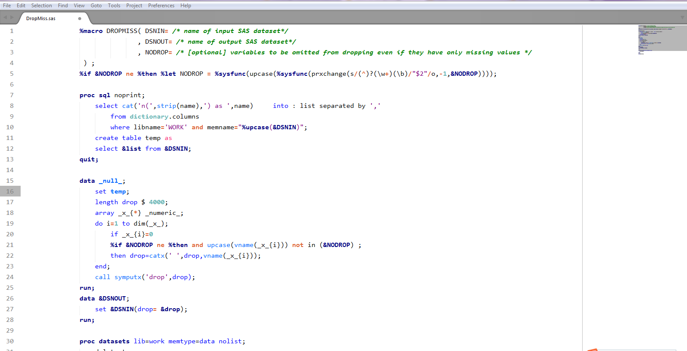

# SAS Syntax Highlight and Theme Package for Sublime Text 3

## What is this?

A Sublime Text package for SAS syntax highlight and color scheme which mimic the SAS system. 

***

## How to Install

#### Via Package Control

The easiest way to install is using [Sublime Package Control](https://packagecontrol.io/), where the package is listed as `SAS-Syntax-and-Theme`.

1. Open Command Palette using menu item `Tools -> Command Palette...` (<kbd>⇧</kbd><kbd>⌘</kbd><kbd>P</kbd> on Mac)
2. Choose `Package Control: Install Package`
3. Find `SAS-Syntax-and-Theme` and hit <kbd>Enter</kbd>

#### Manual

You can also install the theme manually:

1. [Download the .zip](https://github.com/MeetQingLiu/SAS-Syntax-and-Theme/archive/master.zip)
2. Unzip and rename the folder to `SAS-Syntax-and-Theme`
3. Copy the folder into `Packages` directory, which you can find using the menu item `Sublime Text -> Preferences -> Browse Packages...`

***

## Thanks 
The SAS Programming Package developed by [rpardee](https://packagecontrol.io/browse/authors/rpardee), [friedegg](https://packagecontrol.io/browse/authors/friedegg), [seemack](https://packagecontrol.io/browse/labels/snippets).